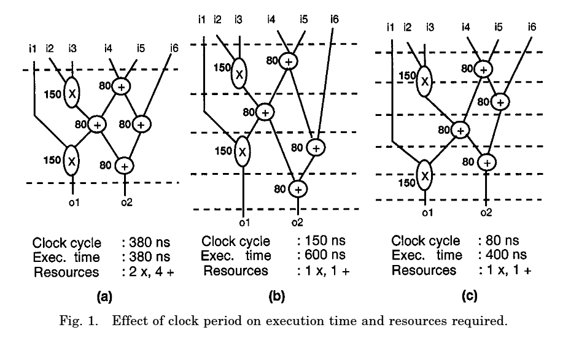
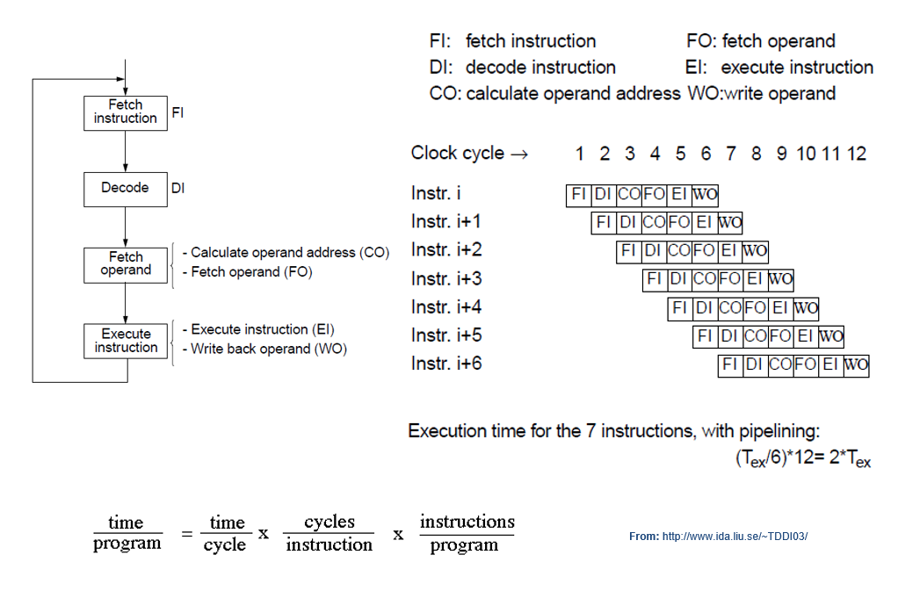
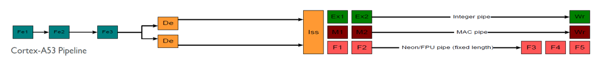

 <br><br></p><h1>TSM_EmbHardw: MAC to GPU</h1>

----
### Index
- [1 Aims](#1-aims)
- [2 Lecture Prologue](#2-lecture-prologue)
- [3 Lecture](#3-lecture)
- [4 Lecture Epilogue](#4-lecture-epilogue)
- [5 Exercises](#5-exercises)
- [6 Laboratory](#6-laboratory)
- [Glossary](#glossary)
- [References](#references)
- [Answers to exercise questions](#answers-to-exercise-questions)

----
## 1 Aims

In this lecture we trace the usage of various concepts extending the idea of an execution core (ALU) of a general purpose CPU. In other words we look at multiply accumulate units, custom instructions, Neural Processing Units (NPUs) and GPUs (graphics processing units). 

----

## 2 Lecture Prologue

The concept of an instruction pipeline is important in this lecture so a review might be in order.

### 2.1 Pipelines
A pipeline is a technique that divides a function into distinct stages.
The purpose is to simplify the design of that function and encourage modularisation and re-usability.
In particular the throughput can be increased by pipelining so it is useful for multiple iterations of a function.

The diagram below illustrates this concept, as well as the time and unit savings, quite well.
On the left we have a functionality, a mathematical operation, that consists of several multiplications and additions.
The input values are clocked in and the output values are clocked out 380 ns later.
The function completes within a time determined by **maximum operator delay** which is the time in which each individual operation needs to complete. 
E.g. the pre-register value of o2 may take on a number of values until it stabilises when the output of the preceding operations have stabilised.
This maximum operator delay thus determines the clock period.
In the middle diagram, individual operations are separated by register stages. 
That is the result of an operator, in this case also after maximum operator delay (the 150 ns of the multipliers), is placed in a clock-driven register for transfer to the next stage.

This technique allows re-use of both the multipliers and the adders. 
The diagram is designed to illustrate the resource saving effects of pipelines and (far right) how clever arracngement of pipeline stages can optimise the execution time.
If however (not the case in this diagram/caption) four adders and two multipliers were to be used, then, after a latency of 4 clock cycles (4 * 150 ns -> 600 ns), a result every 150 ns could be produced, as the registers serve to isolate pipeline stages from each other

<figure class="image">
  
  <figcaption><b>Figure 1:</b> Depiction of a simple pipline system performing a mathematical operation</figcaption>
</figure>

From: [Chang](#901)

### 2.2 Instruction Pipelines
This principle can be used in instruction pipelines. Each stage is completed within a specific time defined by the clock rate.
By dividing up the instruction processing into individual stages, the circuitry can be made simpler, instructions tend to have an equal execution time and instructions can be completed at a regular rate.
The functions of a typical pipeline are depicted in the 6-stage pipeline below. 
This technique is particularly associated with **Reduced Instruction Set Computing** (RISC, as opposed to **Complex Instruction Set Computing** - CISC). 
See [Hennessy & Patterson](#902) for further details.

<figure class="image">
  
  <figcaption><b>Figure 2:</b> Depiction of an instruction pipeline</figcaption>
</figure>


### 2.3 Co-Processors 
Co-Processors perform a function and feature their own instruction set. 
The instruction set can be integrated into the instruction set of the host processor (e.g. a floating point unit) or be provided to the unit over a separate stream (e.g. NVIDIA Jetson series GPUs).
The Jetson is otherwise an example of a memory-mapped co-processor in that the data is placed in shared memory, execution triggered and once completed, results are fetched from shared memory. 
These can also be termed **loosely-coupled co-processors**.
**Tightly-coupled co-processors** are integrated into the host instruction pipeline. 
A good example are the Vector Floating Point (VFP) and SIMD units of the V7 ARM architectures.
These have been more tightly integrated into the ARM V8 architecture.

What is noticable is that ARM supports a standard INT ALU, a separate MAC unt and a SIMD unit.

<figure class="image">
  
  <figcaption><b>Figure 3:</b> ARM V8 instruction pipeline</figcaption>
</figure>

----

## 3 Lecture

[Back To Index](#index)

- [3.1 Notes to Custom Instructions](#31-notes-to-custom-instructions)
- [3.2 Notes to Multiply Accumulate Units](#32-notes-to-multiply-accumulate-units)
- [3.3 Notes to Co-Processors](#33-notes-to-co-processors)
- [3.4 Notes to GPUs](#34-notes-to-gpus)


Having looked at the co-sharing of the ALU between control structures and mathematic operations we now look at HW solutions to computational congestion and how to use them.
Intimately connected with the efficient use of these units is the instruction pipeline

We shall cover 
1. Custom Instructions (CI)
2. Multiply Accumulate units (MAC)
3. Co-Processors 
4. Single Instruction Multiple Data (SIMD) processing
5. Graphic Processing Units (GPU)

### 3.1 Notes to Custom Instructions
It might be possible to optimise the execution by using custom instructions implemented in hardware. 
If you examine the DFG and the equivalent flow in hardware (on the right) you can see that we begin with an array containing RGB values – the load of these values into the registers is done by software.
The second phase, circled in purple, consists of shifting and masking which in hardware carries no cost, its just wiring. 
The beef is in the multiplication by the constants – an 8*6 (or 7*6) as well as the addition can be performed in one clock cycle by hardware, equally the multiplications can be parallelized, that is three dedicated multipliers can be built and an adder. 
[Andrakar](#908) and [Kumar](#909) provide some introductory information on multipliers in hardware: 
The next operations are shifts and formatting which can be achieved in hardware and the store of the greyscale value is in software.
The perspective is to have a load a store and an increment on the loop variable so we could expect to achieve a speed-up of some 73.5%. 

If we write the C code as shown in red on the slide then we need some kind of connection between instruction and hardware. 
Luckily the IP-Processors offer such a thing in the form of a Custom Instruction (CI) linking the hardware with compilable code.

### 3.2 Notes to Multiply Accumulate Units

#### Digital Signal Processors
Digital Signal Processors are the ultimate application specific machine and as such have benefited from many advanced concepts in architectures. 
DSP’s are designed for high speed numeric calculations and as such stretch the limits of processor design. 
The block diagram above is a fairly typical example of a modern DSP. 
The core task is things like filters on streaming data which ends up, more often than not, a convolution operation which reduces to a multiply-accumulate operation. 
The core **functional unit (FU)** is a MAC unit (.M) there are also several other FUs in this device. 
The .D unit is for data accesses, the .L (ALU) and .S (Shifter/ALU) units handle general arithmetic, logical and branch operations. 

The pictured DSP itself features a **modified Harvard architecture** – in this case the physical memory bus is shared but the use of cache allows the separation of data and code accesses. 
Most high performance DSP’s will feature separate external pins for data and code data busses (Harvard architecture). 

The instruction pipeline divides into two (data) paths after the decode stage.
This allows the programmer, or the compiler, to specify the which execution units are used -> parallelisation.
The architecture supports **very large instruction words** (VLIW) (256-bit wide instruction) which is a word with two paths for each four instructions.
This feature optimises the code & execution bus bandwidth by parallelisation. 
Similarly, this DSP features the **load-store** architecture reminiscent of RISC processors. 

DSP’s are not, traditionally, particularly C compiler friendly. 
C is a system language after all. 
Over 50% of DSP solutions are programmed on naked hardware in assembler. 

For information on ARM MAC implementation see [ARM-4](#907)

### 3.3 Notes to Co-Processors
A classical co-processor is a device that supports its own instruction set. 
The use of this device is triggered by co-processor instructions in the program code. 

One mechanism proceeds as follows:
1. The decode stage of the processor will generate an unidentified instruction signal 
2. The processor will ask attached co-processors whether this instruction applies to them 
3. If no then it generates a unidentified op-code exception and lets normal exception processing take over 
4. Otherwise: co-processors will listen to the instruction and one will identify itself as capable of processing the instruction 
5. The instruction is passed for processing to the co-processor. 
6. A processor will (may or may not) continue to execute instructions whilst the co-processor is doing its bit. 
7. If the co-processor is busy and the processor has a co-processor instruction next in its stream – the processor will stall 
8. A co-processor will generally have some form of exception registration  

### 3.4 Notes to SIMD
See [Hennessy & Patterson](#903) for further details. 

ARM intrinsics are documented here: [ARM-2](#905)

### 3.5 Notes to GPUs
In the top piece of code we have a standard loop iteration over the NDRange of 4096 work items.
The middle piece shows the grouping of work-items into work-groups of size 512 – this size can/may be «obvious» from the architecture of the GPU. 
In other words for a GPU with 8 compute units it might be considered appropriate to subdivide the work units to get 8 work groups which can execute on the compute units. 

The read_work_group_size attribute is binding, it can be left to the runtime and/or the compiler to decide how many work-groups. The compiler can be given a hit by the use of work_group_size_hint. The compiler may decide to ignore this hint.    

See [Hennessy & Patterson](#903) for further details. 

---

## 4 Lecture Epilogue

[Back To Index](#index)

### 4.1 Custom Instructions
The NIOS II offered three other forms of custom instruction but is deprecated.
Current RISC-V implementations (including the NIOS-V)offer more flexible variants, including multi-cycle instructions.
The ARM processor also offers custom instructions to licensees [ARM-2](#902).

### 4.3 Co-Processors
Co-processors are problematic, the costs for instruction decoders are high, as are the costs for lifetime inflexibility.
The only real constant has been the floating point unit, and even now ARM has tended to integrate this unit directly into the processor pipeline.  
In the authors lifetime he has seen memory management units, image processors and AI accelerators come and go as co-processors.
There are at least two co-processor architecture/interfaces for the RISC-V, which only serves to fragment the eco-system more.

### 4.4 Graphics Processing Units
ARM Mali GPUs interfaced with openCL are documented here: [ARM-3](#906)

Nvidia GPUs are documented on the Nvidia website.

----

## 5 Exercises

[Back To Index](#index)

### Exercise 1 - Custom Instructions
Given is the program code below. 
Assume that all instructions execute in a single processor cycle (including the JLT instruction !).

```C
int sum=0; 
for ( int i=0; i<10000; i++ ) {
   sum += a[i] * b[i];
   sum /= 2;
}   		
c=sum;   
```
compiles to:

```asm
    		MOVE R5,#0               ; short sum=0
    		R0,#0                    ; for ( i=0; i <= 1000; i++ )
    		MOVE R1,#&a[0]           ; load address of vector a
    		MOVE R2,#&b[0]           ; load address of vector b
  	loop: 	LOAD R3,R0[R1]           ; load value of vector a
  	        LOAD R4,R0[R2]           ; load address of vector b
  	        MUL R3,R3,R4         
  	        ADD R5,R5,R3
    		ASR R5,R5,#1             ; sum /= 2
    		ADD R0,R0,#1             ; i++ )
    		CMP R0,#10000            ; i <= 1000; 
    		JLT loop                 ; jump to loop on less than
    		MOVE R6,#&c              ; c = sum
    		NOP
    		STORE 0[R6],R5
```

1. Mark with a circle all assembly instructions that can be replaced with a NIOS II combinational custom instruction 
2. When using custom instructions, how many assembly instructions do we add to/remove from the code? 
3. When using custom instructions, how much do we speed up the loop of this code? 


[Answer](#answer-to-exercise-1---custom-instructions)

### Exercise 3 - SIMD Vector Processing
1. A 16 lane vector of uint8 is how large?
2. Two of these vectors are multiplied together. The answer is stored in a vector of the same size. How many lanes of what type does this vector have?
3. The following arrays are added together in vectors of 64 bits. How many instructions are required and how large is the result array? Write psuedo code to achieve this target

```C
#define ARRAY_SIZE 128
uint8_t array_a[ARRAY_SIZE]:
uint8_t array_b[ARRAY_SIZE];
```
4. Two vectors of uint16 with each element initalised to 0xFFFF are added, what is the result if the operation is defined as saturating?
5. Convert the RGB2Gray problem to a vector-based solution by drawing the data flow through the vectors.

[Answer](#answer-to-exercise-2---vector-processing)

### Exercise 3 - GPU
Consider the following code:
```C
#define LOOP_SIZE 10000
    
int main ( void ) {

    long int array[LOOP_SIZE];
    int c = 2;
    int d = 3;
    int e = 0;

    for (long int i = 0; i < LOOP_SIZE; i++) {
        e = c * d + e;
        array[i] = e;
    }

/* ********** End Insert      ********** */
}
```
1. What parts of the code can be offloaded to a GPU and what parts should remain on the host? What does your solution actually do?
2. If the suggested (openCL) work_group_size/local_size is 32, what is the NDRange and the range of local indices?
3. Supposing the number of executing cores available is 32 and scheduling of kernels/threads is strictly in-order issuance and in-order execution. What global thread ID will execute on what core after three work-items have been processed?
4. Structure the RGB2Gray code as a GPU-bound kernel.
5. Explain why a MAC operation is not well suited to parallel processing and hence GPU code.

[Answer ](#answers-to-exercise-3---gpu)


----

## 6 Laboratory

[Back To Index](#index)

### Lab 1 - Multiply Accumulate
Using Compiler Explorer (www.godbolt.org) and code templates from the last lecture, implement C code for a multiply accumulate operation, for instance: 
```C
#include <stdio.h>
#define LOOP_SIZE 10000
    
int main ( void ) {

    int array[LOOP_SIZE];
    volatile int c = 2;
    volatile int d = 3;
    volatile int e = 0;

/* ********** Insert Code here ********** */

    for (long int i = 0; i < LOOP_SIZE; i++) {
        e = c * d + e;
        array[i] = e;
    }
    
    (void)printf("The values of the first two elements of array[i] are %d and %d\n", array[0], array[1]);

/* ********** End Insert      ********** */
}
```
Using an ARMV8 compiler note the method of implemtation of the multiply accumulate. 
You probably will see a `mul` followed by an `add`.
Compile using the compiler option `-O3` and verify if the `madd` instruction is used.
In both cases compare the number of instructions unecessary. 

### Lab 2 - Multiply Accumulate 
Implement an inline assembler instruction for the MADD instruction. 
You can use this code as a starting point (for ARM compilers)

```C
__attribute__( ( always_inline ) ) static __inline__ uint32_t __SMUAD  (uint32_t op1, uint32_t op2)
{
    uint32_t result;

    __asm__ volatile ("smuad %0, %1, %2" : "=r" (result) : "r" (op1), "r" (op2) );
    return(result);
}
```

### Lab 3 - SIMD
Write and compile the RGB2Grey function from exercise 3. For the ARM NEON see [ARM-2](#905) 

### Lab 4 - GPU
Write and compile the RGB2Grey function from exercise 4 for either a openCL or a CUDA GPU.

**Note openCL** you can compile openCL code on Compiler Explorer.
You need to pick the language `openCL C` and the compiler.
You can compile openCL programs with the `armv8-a clang` compiler generating ARM assembler, making it a lot easier to understand.

**Note CUDA** CUDA is the NVIDIA interface. NVIDIA offers openCL for high-end GPUs but not for the (embeddable) Jetson series.
It is possible to compile CUDA programs on Compiler Explorer, Language settings `CUDA C++` and comnpiler settings `NVCC`.
It is also apparently possible to run programs on Compiler Explorer but it hasn't worked for me yet.

**Note:** There is substantial effort involved in installing the CUDA toolset - it follows a replacement strategy (i.e anything it doesn't like it replaces).
I haven't tried it, but maybe an environment manager might work, although I rather doubt it.
If you do wish to do some exercises on a GPU try the optimisation exercise published by NVIDIA.
I do it in a dedicated class and its quite accessible for novices.

----

### Glossary

---

### References
<a id="901">Chang</a>
En-Shou Chang, Daniel D. Gajski, and Sanjiv Narayan. 1996. 
An optimal clock period selection method based on slack minimization criteria. 
ACM Trans. Des. Autom. Electron. Syst. 1, 3 (July 1996), 352–370. 
https://doi.org/10.1145/234860.234864

<a id="902">Hennessy and Patterson</a> 
Appendix C Pipelining: Basic and Intermediate Concepts
Hennessy, John L.; Patterson, David A.. 
Computer Architecture: A Quantitative Approach (The Morgan Kaufmann Series in Computer Architecture and Design) (p. 292). 
Elsevier Science. Kindle Edition. 


<a id="903">Hennessy and Patterson</a> 
Chapter Four Data-Level Parallelism in Vector, SIMD, and GPU Architectures 
Hennessy, John L.; Patterson, David A.. 
Computer Architecture: A Quantitative Approach (The Morgan Kaufmann Series in Computer Architecture and Design) (p. 292). 
Elsevier Science. Kindle Edition. 

<a id="904">ARM-1</a>
'NEON and VFP Processing'
https://developer.arm.com/documentation/dui0473/c/neon-and-vfp-programming
Last accessed 05.10.2025

<a id="905">ARM-2</a>
'Intrinsics'
https://developer.arm.com/architectures/instruction-sets/intrinsics/#f:@navigationhierarchiessimdisa=[Neon]
or
https://arm-software.github.io/acle/neon_intrinsics/advsimd.html
Last accessed 05.10.2025

<a id="906">ARM-3</a>
'ARM Mali-T600 Series GPU OpenCL Developer Guide'
https://developer.arm.com/documentation/dui0538/f/opencl-concepts
Last accessed 05.10.2025

<a id="907">ARM-4</a>
'Arm A-profile A64 Instruction Set Architecture'
https://developer.arm.com/documentation/ddi0214/b/instruction-cycle-times/multiply-and-multiply-accumulate

ARMV7
https://developer.arm.com/documentation/ddi0602/2025-09/Base-Instructions/MADD--Multiply-add-?lang=en
Last accessed 05.10.2025

<a id="909">Kumar</a>
M. Sai Kumar, D. A. Kumar and P. Samundiswary, 
"Design and performance analysis of Multiply-Accumulate (MAC) unit," 
2014 International Conference on Circuits, Power and Computing Technologies [ICCPCT-2014], Nagercoil, India, 2014, pp. 1084-1089, 
doi: 10.1109/ICCPCT.2014.7054782.

<a id="908">Andraka</a>
http://www.andraka.com/multipli.php


----
### Answers to exercise questions

[Back To Index](#index)

#### Answer to exercise 1 - Custom Instructions
1. The following code
```C
  	        ADD R5,R5,R3
    		ASR R5,R5,#1    
``` 
From the execution time the preceeding multiplication could in theory also be added but the number of individual registers required is one to many (R3, R4, R5 - the NIOS only supports two as inputs for CIs)
2. 8/7 times (one instruction eliminated by using a custom instruction) 
3. Just one - unlike with loop unrolling the loop remains


#### Answer to exercise 2 - SIMD Vector Processing
1. 16 lanes each of uint8 = 128 bits
2. Without the use of modifying instructions (narrowing/widening) the same as the input vectors.
3. 
```C
#define ARRAY_SIZE 128
uint8_t array_a[ARRAY_SIZE]:
uint8_t array_b[ARRAY_SIZE];

Do ARRAY_SIZE/(vector_size/type size) times
     load 64 bit register A with 8 uint8 values from memory
     load 64 bit register B with 8 uint8 values
     perform vector addition - result in 64 bit register C$
     store vector 64 bit register C to uint array in memory  
```
4. Each element (regardless of size of the vector) has a value of 0xFFFF 

#### Answers to exercise 3 - GPU
1. The for loop can be converted into a kernel
2. The NDRange ia LOOP_SIZE and local indices run from 0..31
3. 32 (work_size) iterations will run on 32 (number of cores) cores.
```text
Iteration 1 global_id [0 ... 31]
Iteration 2 global_id [32 ... 63]
..
Iteration 4 global_id [96 ... 127]  
```
4. The conversion to a kernel should be obvious - the quirk with this problem is that LOOP_SIZE is not (integer) divisable by 32 with the result that a check must be made. We already know that such a check is non-optimal but, badly done, it introduces divergent code into the solution. Divergent code (if / else) causes threads taking the `else` route to wait until the threads taking the `if` route have completed, and vice versa. So the idea is to introduce non-divergent code to handle the threads that have global IDs larger than the vector size.

[def]: #answers-to-questions