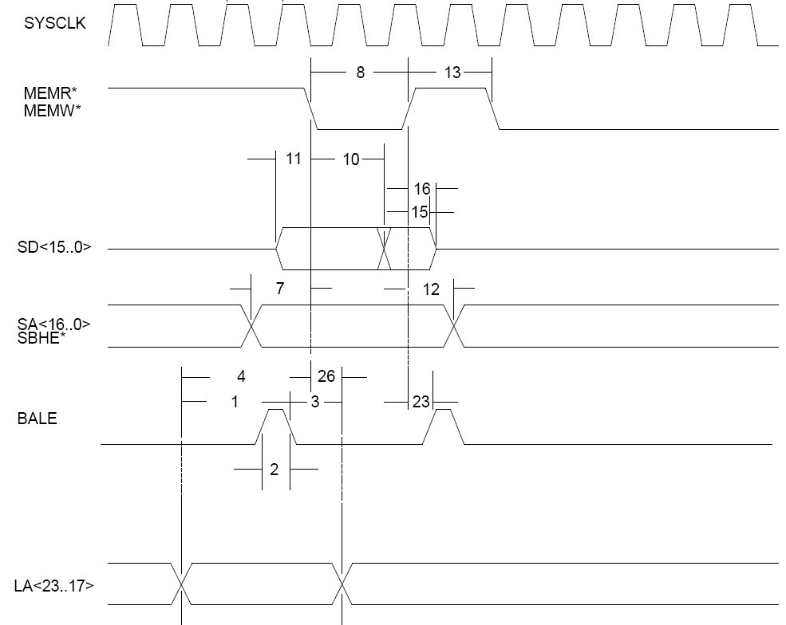
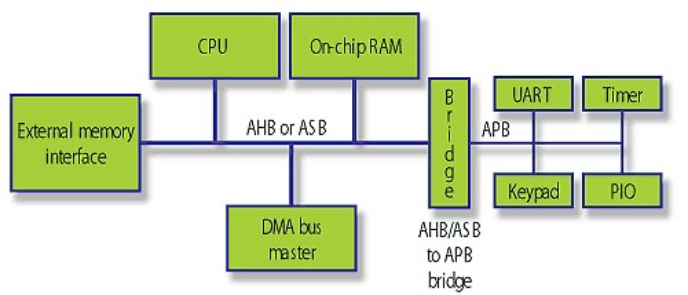

   
<h1>TSM_EmbHardw: Bus Systems</h1>

----
### Index

- [1 Aims](#1-aims)
- [2 Lecture Prologue](#2-lecture-prologue)
- [3 Lecture](#3-lecture)
- [4 Lecture Epilogue](#4-lecture-epilogue)
- [5 Exercises](#5-exercises)
- [6 Laboratory](#6-laboratory)
- [Glossary](#glossary)
- [References](#references)
- [Answers to Questions](#answers-to-questions)

----
## 1 Aims

An introduction to parallel bus systems found in microcontrollers and SoCs from the viewpoint of bottlenecks in computer architectures.

----

## 2 Lecture Prologue

Parallel bus systems originate from the necessity of connecting microprocessors to external devices and   were hence intimately connected to the CPU architecture. 
Over the last 50 years or so they have become both a central feature and limiting factor of computer systems and possess (business-) strategic importance.

This chapter will briefly examine the development of bus systems in preparation for the lecture.

### 2.1 Parallel Bus Systems in Computer Architectures

#### 2.1.1 Fundamental Bus Architectures 
CPUs require a performant method of accessing external components which implies that this interface should preferrably support the instruction set architecture bit width (16/32/64-bits).
Under the term components we term memory, and I/O interface devices, including graphics, serial busses and the like.
The only performant option is a parallel bus.

Parallel bus systems were long accepted to be the fastest method of transferring bits from one element of the computer architecture to another.
Parallel busses in processor architectures were generally used to transfer data and code from memory (primary, secondary, teritary) to the processor core.
This implies that the data must be addressed before being transferred (what data is required). 
Memory generally must know whether data is being read from the device or being written to, therefore control systems are required.

A parallel bus therefore features three categories of signals: address; data; control. 

The two fundamental computer architectures are the von Neumann and Harvard architectures.

#### 2.1.2 Harvard Architecture
The Harvard architecture uses separate busses to transfer code and data to the processor core.
Program execution determines the accesses of the processor core on external memory.

**Pros:**
1. If code and data accesses occur on the same bus simultaneously, then one access must wait for the other to complete before being able to start. 
By separating data from code access, this potential mutual exclusion is avoided. 

**Cons:**
1. Chip-manufacture costs and importantly failures are directly proportional to: the area of silicon; the number of pins the device requires.
Therefore, if a device requires two external bus systems then the costs of the device are proportionally higher (and significant).
2. Computer system developer must maintain two separate bus systems on the printed circuit board (PCB)

#### 2.1.3 von Neumann Architecture
The von Neumann architecture combines the transfer of data and code on one bus. 
**Pros:**
1. Processors and Microcontroller are expected to be cheaper (fewer pins).

**Cons:**
1. The risk of mutual exclusion caused by bus contention on the combined bus is increased. The program execution time may therefor increase. This increase is opaque to the programmer. 

It is generally accepted that device cost outweighs the issues of potential mutual exclusion.

### 2.2 ISA-Driven Bus Topologies
#### 2.2.1 Old CPU bus topologies 
Older CPUs separated memory accesses from I/O accesses. 
That is there was a separate address range for I/O and memory

**Pros:** 
1. The entire address range could be used for memory

**Cons:**
1. CPU internals are more complex
2. CPU requires separate instructions for memory and I/O accesses
3. CPU requires more pins 
4. Computer system architect must maintain two separate bus systems on the circuit

#### 2.2.2 Memory Mapped Topologies
It is possible for the computer system designer to map the I/O address range into the memory address range.

**Pros:**
1. The CPU becomes more generic
2. CPU code must not differentiate between I/O and memory
3. The differentiation between I/O and memory can be done by the circuit designer

**Cons:**
1. I/O devices are always slower than the on-board memories (i.e SRAM/DRAM). Bus contention may occur.

**Note:**
Most processor instruction set architectures (ISA) eschew separate I/O address spaces. 
The exception is Intels' x86 ISA which, for backward compatibility reasons, still supports I/O instructions.   

### 2.3 Processor Driven Topologies
The processor is not generally designed by committee but by a chip designer to make life convenient for themselves.
This includes the external interfaces, especially the external bus interface.  
The external bus interface timing was typically driven by the processor. 
That is the collection of signals (address, data, control) and their timing relationships accesses and the timing thereof are dictated by the processor - and typically/crucially, the processor clock. 

This can be seen in the figure below where the relationship between timing events is clearly driven by the processor clock

<figure class="image">
  
  <figcaption><b>Figure 1:</b> Industry Standard Architecture (ISA) mem/I/O bus timing</figcaption>
</figure> 

[[Ampro]](#1)

The ISA bus - defined by IBM PC/AT architecture, later IEEE P996 - was derived from the 8088 8-bit processor, later 8086 and was 
processor-clock driven. One of the early CPU busses, the following cycles were supported: memory R/W 8/16-bit; I/O input/output 8/16-bit; refresh (for DRAM), DMA transfer

The processor must access an external bus for at least two reasons
1. Fetch code
2. Read/write data

These two accesses are achieved by two separate and, typically, uncoordinated units. 
The instruction-fetch unit and the data access unit. 
Assuming a von Neumann architecture, these accesses must be consolidated to unequivocal access on the external bus. 

### 2.4 Computer Architecture-Driven Bus Topologies

#### 2.4.1 Processor-Independent Bus Systems
By separating the processor bus from the external bus it is possible to develop I/O devices which are suitable for each processor type. 
This was the case for instance with PCI which was developed by Intel (and others) for various reasons. 

The development of processor-independent bus systems resulted in interfaces between a processor bus and the external bus being implemented as a bridge

**Pros:**
1. Bus operation is now independent of the processor clock
2. The computer system architecture is (at least partially) independent of processor
3. External parallel interfaces (slot-cards in PC-speak) are strongly defined and can be certified as being compliant 
4. Access to the bus is systematically defined
5. Given adherence to the design guidelines the practical performance of the bus is predictable 
6. Attached devices/components can be identified by software - device trees can be constructed - useful for operating systems 

**Cons:**
7. The bus specification defines the computer system performance
8. I/O accesses are still slow but can be delegated to the I/O interface component
9. Is not suited for fast and evolving memory/graphics performance
10. All attached devices must implement the bus specification in full, regardless of the functionality of the device.

#### 2.4.2 Multi-Level Topologies
Memory and graphics accesses are a performance marker for processors - to ensure the best performance, high-performance processors provide separate interfaces for memory and graphics.

I/O accesses latency is driven by the I/O device (think hard disk with 1 ms access time).
Burdening the I/O interface devices with high-speed electrical interfaces makes the device more expensive without increase in performance.  
To mitigate this issue, bridges can also be used to separate bus systems into different levels - fast and slow for instance.
This represents a *multi-level* bus

<figure class="image">
  
  <figcaption><b>Figure 2:</b> ARMs conception of a multilevel bus with a, for the time, high-speed bus (AHB) bridged with a peripheral bus (APB) upon which I/O is attached</figcaption>
</figure> 

----

## 3 Lecture
The lecture will pick up and develop several strands from the prologue, namely:

1. Brief overview of Bus Systems history and technology
2. ARM Advanced High-Performance Bus (AHB)
3. Use Case 1: Alignment
4. Use Case 2: DMA

There are a couple of filler slides ( ... if time remains) on 

1. MAC DMA (Buffer descriptors & scatter-gather DMA)
2. I/O device abstractions

### 3.1 Additional Notes on AHB
AHB supports four phases

(1. arbitration)

2. address setup - The address and necessary control signals are placed on the bus.
3. data transfer - the data is presented to the device, or for a read cycle,. vice versa. 
4. response - The device confirms the correct transfer.

These three stages are pipelined. It is possible for instance to place the address on the bus for the next transfer whilst the previous one is still being concluded. 

The precise operation and the meaning of the signals can be read in the relevant documentation [[ARM-2]](#6)

### 3.2 Additional Notes on Alignment / memcpy()
memcpy() is a standard C library function used for copying blocks of memory around. 
It’s the kind of standard function that lots of people just use without considering what it does. 
Unfortunately its behaviour can cause lots of surprises. 
There is no universal standard implementation but there are several derivatives. 
The graphs above were taken from an article from eetimes/embedded.com  by Michael Morrow -> http://www.eetimes.com/design/embedded/4024961/Optimizing-Memcpy-improves-speed  but the issue is well known. Morrow compares a simple byte-for-byte (green – first column), one that recognises byte alignment on 32-bit boundaries (pink – middle column) and one that manipulates the data as shown as shown in the diagram on the top. He then goes and compares the performance of the three algorithms on various data transfer sizes. Given that there is no cache enabled and the source and, in the first two cases, destination addresses are on 4-byte boundaries, the first chart shows the performance for 20 byte data blocks, the second for 128 bytes and the third for his optimised memcpy() for non-aligned source and destination addresses. Its clear that each algorithm has its pros and cons and the message here is that we should think about what we are trying to do before just using memcpy. In our Institute we have often re-written memcpy() for specific performance features.
Other similar functions are strcpy() and memset()      

### 3.3 Additional Notes on DMA
We can allocate a DMA unit – here also we need to look at how DMA operates.
DMA is judged to be faster than a memcpy() because the instruction (and loop) overhead is expensive. 
On the other hand memcpy()’s are easy to schedule as they are merely part of the sequential program. 
DMA implements the loop in hardware which makes it faster than memcpy() but it is a different bus-master and hence it contests the bus (or resources such as memory) with a continuously executing resource, the CPU. 
It also requires scheduling. 
The whole point of the DMA is to work in parallel with a computing resource. 

This means that there are three steps to using DMA:
1. Initalise DMA (CPU)
2. Perform DMA (DMA -> non linear improvement)
3. Post-hoc processing (CPU) 

There are several operation modes of DMA:

**Burst Mode:** the contiguous block is transferred in one – this means that the resource (system bus and/or memory) is solely reserved by the DMA unit and the CPU has no access to the resource – i.e. either it essentially stops or, if it can run solely from cache, it does its bit internally. 

**Cycle Stealing Mode:** by continually requesting and yielding the control of the bus/resource the DMA controller can force interleaving which, if the CPU is the priority master, should mean that the CPU is not much braked. 
This does however mean that the DMA transfer takes longer.

**Transparent Mode:** In this case the CPU never waits for the resource (f.i. system bus) and the DMA only transfers when the CPU doesn’t need the bus. This requires that the DMA and the CPU must be intimately connected to ensure that the prediction (i.e. the fact that the CPU will not require the bus for a certain number of cycles) functions correctly. Obviously this affects the run-time of the program least but it does increase the length of the DMA transfer, and hence the achievable scheduling.  …

**Flyby Mode:** this isn’t supported by many microcontrollers but it transfers data in one cycle rather than the read/write cycle. 

----
## 4 Lecture Epilogue

The further development of parallel bus systems has been the development of: 
1. Multilevel Bus Systems - a bus topology change through addition of additional layers allowing semi-permanent connection of peripherals to multi-core architectures 
2. Streaming Bus Systems - conceptually a serialisation and packetization of bus transactions allowing interleaving of answers from devices as well as out-of-order responses by devices. This can increase the utility of the bus system upto 80%. See the AMBA AXI specifications for further details ([[ARM-3]](#7)). 

There are studies of how bus transactions affect the Worst Case Execution Time (WCET) of a program under heavy bus utilisation.
This is important in several industries were fully deterministic execution is considered imperative, including in functional safety (e.g. aeronautics) [[Yan et. al.]](#5).

----

## 5 Exercises
### Question 1
a. Name two bus system categories used in computer architectures

b. Name an example of each

c. What is the relevance of a bus system to computer architecture

### Question 2
a. A Double Data Rate (DDR) SDRAM interface of an embedded microcontroller professes a 16-bit dedicated parallel interface clocked @ 166 MHz. 
DDR facilitates transfer on the rising and falling edge of the bus clock. 
What is the theoretical transfer speed in MBytes/s?

b. For efficiencies' sake the data is transferred in transactions of 8 beats of each one 16-bit word. 
For how long is the bus occupied in each transaction? 
We ignore the details of SDRAM addressing AND any address setup.

Note: This is a practical example - the actual measured speed on this device is 420 MBytes/s. 
This is attributable to the overhead of SDRAM address initalisation and any necessary delays due to bus protocol. 

c. If a second microcontroller is added to the bus and transfers performed as in Q2b, what will the effect on the bus occupation by the two processor be?

----

## 6 Laboratory

There is no lab exercise associated with this lecture.

----

### Glossary

Bus contention - when two potential bus masters access the bus at the same time, a decision must be made which of the two receives (first) access. 

Mutual exclusion - if one actor holds a resource exclusively whilst other actors must wait until the resource is released. 

### References
<a id="901">Ampro</a>
ISA Bus Timing Diagrams (1998).
Ampro Computers Inc.
http://www.ee.nmt.edu/~rison/ee352_spr12/PC104timing.pdf
Last accessed 15.07.2025

<a id="902">ARM-2</a>
AMBA AHB Protocol Specification
https://developer.arm.com/documentation/ihi0033/c 
Last accessed 15.07.2025

<a id="903">ARM-3</a>
AMBA AXI Protocol Specification
https://developer.arm.com/documentation/ihi0022/l/?lang=en
Last accessed 15.07.2025

<a id="904">Buchanan</a>
Buchanan (2000) 
'Computer Busses', 
Butterworth Heinemann.

<a id="905">Hennessy and Patterson</a> 
Hennessy & Patterson (2017)
'Computer Architecture: A Quantitative Approach'
6th Edition, Elsevier LTD. 
Appendix F Interconnection Networks

<a id="907">Jalle</a>
J. Jalle, J. Abella, E. Quiñones, L. Fossati, M. Zulianello and F. J. Cazorla, 
'AHRB: A high-performance time-composable AMBA AHB bus' 
(2014),
IEEE 19th Real-Time and Embedded Technology and Applications Symposium (RTAS), Berlin, Germany, 2014, pp. 225-236, doi: 10.1109/RTAS.2014.6926005.

<a id="907">Peng</a>
Yu Peng 2 Yanmeng Ba1 Bo Li3,
(2009)
'A Design of PCI-Bus High Speed Serial Communication Card.' 
Proc. Of the Ninth International Conference on Electronic Measurement & Instruments ICEMI’2009. 
(http://ieeexplore.ieee.org/stamp/stamp.jsp?arnumber=05273990 .

<a id="908">Huang</a>
Tai-Yi Huang; Liu, J. W -S; Hull, D.,
(1996)
'A method for bounding the effect of DMA I/O interference on program execution time'
Real-Time Systems Symposium, 1996., 17th IEEE, vol., no., pp.275,285, 4-6 Dec 1996

<a id="909">Morrow (2004)</a>
Morrow, M
(2004)
https://www.embedded.com/optimizing-memcpy-improves-speed/?utm_source=eetimes&utm_medium=networksearch
Last accessed 01.09.2025

----
### Answers to questions
#### Q1
A1a: Parallel Bus / Serial Bus

A1b: PCI, AMBA, Wishbone / SPI, I2C, UART, USB, Ethernet, PCIe.

A1c: It directly affects the speed of data/code access from RAM as well as the connectivity to I/O devices.

##### Comments 
If you got stuck on question Q1a or Q1b: The answers fall under the category of general knowledge. 
The introductory sections of a book such as [[Buchanan]](#3) will serve you adequately.

If you got stuck on question Q1c: There is a good introductory reference: [[Hennessy and Patterson]](#4) 'Computer Architecture: A Quantitative Approach' Appendix F Interconnection Networks

#### Q2
A2a: Bus speed ia 166 MHz. so two words of 16 bits transferred every bus cycle and 8 bits per byte gives 664 MBytes/s

A2b: 8 beats -> 8 words transferred in 4 clocks. 2.409 microseconds.  

A2c: If both microprocessors are independent and transferring data according to Q2b then resource sharing must be achieved.
Arbitration must be used. This means that each time the processor wishes to initiate a transaction, the bus must be requested from the arbiter. If the bus is gained and released on a transaction basis then a First Come First Served (FIFO) arbiter will effect an interleaving, possibly irregular, of  transactions reflecting the queue of requests from the controllers.  

----