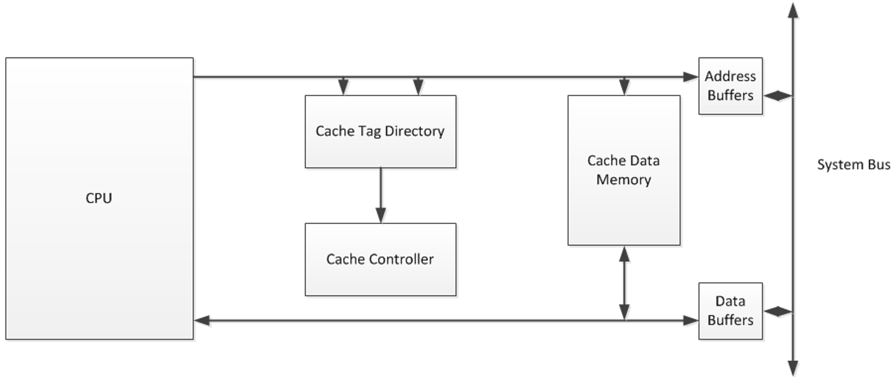
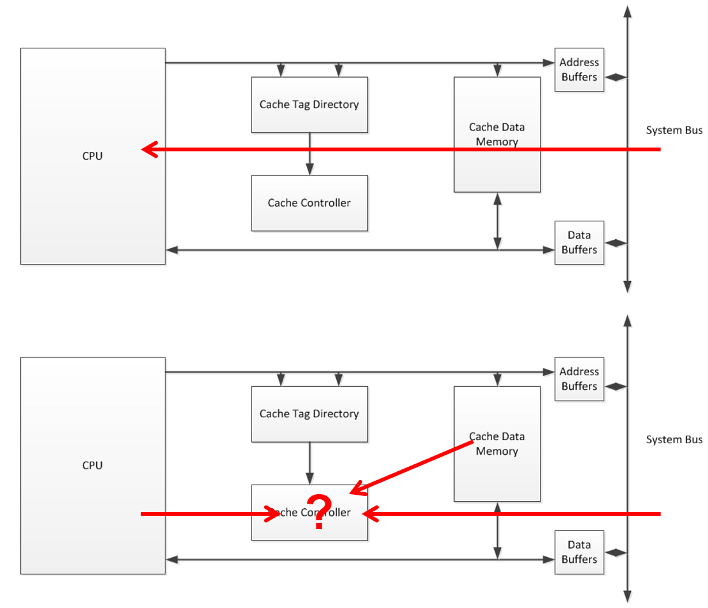
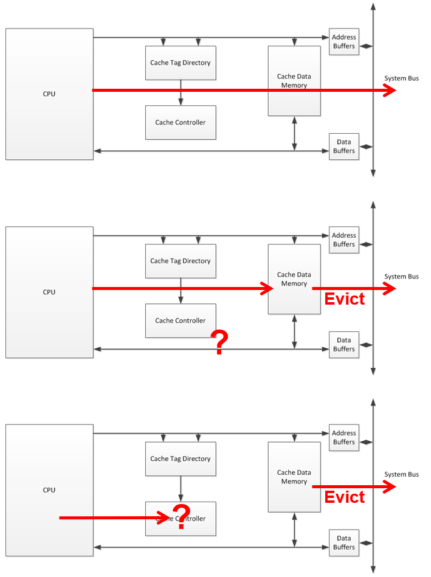
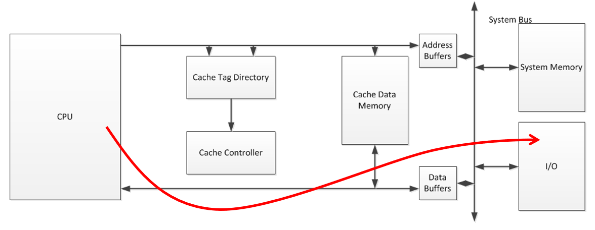
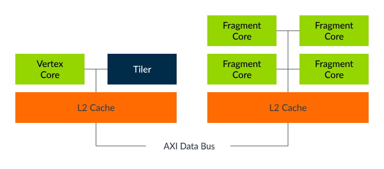

 <br><br></p><h1>TSM_EmbHardw: Cache and Tightly Coupled Memory</h1>

----
### Index
- [1 Aims](#1-aims)
- [2 Lecture Prologue](#2-lecture-prologue)
- [3 Lecture](#3-lecture)
- [4 Lecture Epilogue](#4-lecture-epilogue)
- [5 Exercises](#5-exercises)
- [6 Laboratory](#6-laboratory)
- [Glossary](#glossary)
- [References](#references)
- [Answers to exercise questions](#answers-to-exercise-questions)

----
## 1 Aims

In this lecture we discover some ways to use cache and tightly coupled memory effectively.
These include correct alignment, prefetching, tiling and locking and some considerations for tightly coupled memory.

----

## 2 Lecture Prologue
Our interest is in the effective use of cache and less how it functions.
There is an overlap of the two so we use this chapter to recap some cache fundamentals. 
For further details, both [Hardy](#901) and [Hennesy and Patterson](#902) handle the basics and advanced concepts quite well. 

During exam preparation students will understand and be able to explain all the concepts printed **in bold**.

### 2.1 Cache - Grounding Theory
Research in the 60's formulated the idea of 
- **CPU bound** algorithms are algorithms that use bursts of CPU time
- **I/O bound** algorithms are algorithms that spend much time waiting for I/O

from this the **localisation principle** can be derived
- Programs tend to spend time (**temporal locality**) in the same area (**spatial locality**). 

Example: code in loops (spatial) spending time (temporal) executing operations on arrays (spatial). 

We know, implicitly or explicitly, that
- External accesses by a CPU are expensive in time, therefore
- Fetching code/data from RAM is expensive in time
- Principle of locality means that some sections of code/data will be frequently accessed
- Local temporary storage of this code/data will save time and increase performance of the platform

There are two solutions to achieve this local temporary storage
- **cache** 
- **tightly coupled memory** (TCM aka **scratchpad memory** (SCM))

Cache has its adherents because 
- Pro: This form of local memory is maintenance free and so transparent to the programmer$
- Con: You are stuck with what the CPU designer chooses to give you

Whereas 
- Con: TCM typically requires runtime maintenance by the programmer
- Pro: TCM gives the programmer options to use it as she wishes

### Local Memory - Integration in Computer Architecture
Memory is
- slower than the CPU
- expensive in silicon footprint

Cache and TCM are therfore substantially smaller than main memory.
There exists, therefore, the concept of **memory hierarchy** 


Cache is part of the memory hierarchy and typically multilevel L1 -> L3.
L1 and L2 are typically within the microcontroller package, L3 external.
L1 and L2 are standard on midrange embedded processors.
Cache is *transparent* to the programmer - there is a limited API between the memory and the programmer.
TCM is not really mart of the memory hierarchy, being totally under the control of the programmer.
Both memories are typically SRAM implementations.

Referring to the figure below.
On the far left we see the integration of TCM in the memory hierarchy. 
It is only part of the hierarchy insofar that being local, the access times are substantially smaller than memory located outside of the CPU package.
Modern microcontrollers will typically integrate cache and may offer TCM.
Even if TCM is offered by the CPU architecture, an (**rich** operating system, typically a multi-process OS like Linux) operating system may not support it (case in point RaspiOS - for further details see Section 4: Lecture Epilogue).

In the middle we see the memory hierarchy of a typical (modern - aka 32/64-bit) embedded processor.
There are two cascaded cache levels (L1 & L2) in the CPU package **in the path** to external main memory.

In the far right we see the memory hierarchy of a higher-end processor (think desktop/laptop-grade CPU).
There are three cascaded cache levels (L1, L2 & L3) in the CPU package **in the path** to external main memory.

<figure class="image">
  
  <figcaption><b>Figure 1:</b> Memory Hierarchy</figcaption>
</figure>

### Cache - Components
Cache consists of 
- a cache space, the memory itself 
- a cache tag directory
- a cache controller

#### Cache Memory
Cache memory is organised in **cache lines** (aka **blocks** - I prefer the use of the word "lines" because it is more specific).
The size of a L1 cache line is CPU (but not instruction set architecture (ISA)) specific. 
The size of the cache line varies between 32 and 64 bytes.
An L1 cache of 2 kBytes therefore supports 32 cache lines.
L2 and L3 typically support the same line size.

#### Cache Tag Directory
Cache memory is substantially smaller than main memory so the entire address range of main memory must be mapped in some way into cache memory.
The fundamental granularity of upstream cache memory access is the smallest access unit of the CPU (typically a byte).
The fundamental granularity of downstream cache memory access is a line.
For large main memory to be *transparently* mapped into substantially smaller cache memory an addressing scheme is required.
This mapping is best explained with an example.

Example - 
- main memory = 8 bits wide, 64 kBytes -> 16-bit address bus
- cache L1 memory = 4 kBytes @ line size 32 bits 

From the far right. an 8-bit wide, 64 kBytes memory features an address range from #0000 -> #FFFF.
From the (downstream) point of view of a cache with 32-byte line size, this is modelled as a 32-byte wide memory with address range from #0000 -> #FFE0.
From the upstream point of view of a cache the processor can access in byte increments so accessing the bytes in the first line can be achieved from offset #00 -> #1F
This represents 2high5 bits, so the offset part of the address are the 5 least-significant bits.
The other 11 address bits are required to identify from where the cache line has been filled.
These 11 bits are entered by the cache controller into the tag directory. 

<figure class="image">
  Cache Mapping">
  <figcaption><b>Figure 1:</b> Memory->Cache Mapping</figcaption>
</figure>

#### Cache Controller
The cache controller manages the cache system to varying degrees of complexity.
Its most fundamental task is to check, during a CPU driven memory request, whether the requested datum is in cache memory (L1 ... L3) or needs to be fetched from main memory.
It does this ion the basis of the tag directory, comparing the tag address of the required datum with that of the entries in the tag directory.
If it can't find the tag address it repeats this search in the tag directory of L2 cache and so on until it recognises that the datum is not in cache and must be retrieved from external memory. 

The cache controller implements architecture-individual **cache policies**, which will be touched on later. 

<figure class="image">
  Cache Mapping">
  <figcaption><b>Figure 1:</b> Memory->Cache Mapping</figcaption>
</figure>

### Cache - Hit and Miss Rates

Cache size and policies affect the hit rate. 
The **hit rate** is the probability that the looked-for datum is resident in the cache. 
For example a cache with a hit rate of 80%, a very low number, will execute a read in 2 CPU cycles. 
For the remaining 20% the CPU must access the system bus at a cost of 3 additional cycles. 
Therefore, for say 10 instructions the cost is 10*0.8*2 + 10*(1-0.8)*5 = 16 + 10 CPU cycles. 
Hence, for nearly 40% of the time the CPU would be unable to get to 20% of the instructions. 
If the hit rate was to be increased to a more reasonable number such as 90% then the arithmetic would be:
10*0.9*2 + 10*(1-0.9)*5 = 18 +5 CPU cycles  
The **miss rate** is decreased by half.   

<figure class="image">
  
  <figcaption><b>Figure 1:</b> Depiction of the basic cache architecture</figcaption>
</figure>

### 2.2 Cache and the Basic Read Operation
Cache operation can be sumerised as follows:
- If the CPU requires data or code (data read / instruction fetch) it will generate an address
- If the contents of that address are not in cache the drivers will be activated and external components will be accessed
- This is known as a **cache miss**
- In the case of a cache miss, the contents of that address will be placed in cache memory whilst it is being transferred to the CPU
- Address contents are transferred in **cache lines**, at the time of writing commonly 64 bytes.
- This is known as a **line-fill**
- The next time the address or a surrounding address, is accessed the contents will already be in cache, representing a **cache hit**
- A **compulsory line fill** is one which could not have been avoided using a better cache policy.

A design which allows all signals from the CPU to access the main memory regardless whether it’s a hit or a miss is known as a **look aside** implementation (Fig 2. top). 
This makes for faster single-processor read miss accesses since by the time the cache controller realises it has a miss, the system memory is well on its way to getting the required data ready for the CPU. 

**Look through** (Fig 2 bottom) or in-line caches are typical where the cache controller decides whether to initiate a system memory read/write or not. 
This kind of implementation massively reduces the CPU-required bandwidth at the cost of the so-called **lookup penalty**, the time required to decide that a system memory access is required. 
In a read hit the system bus address and data buffers remain switched off and the Cache Data Memory buffers are switched on, allowing the datum to proceed to the CPU as if it were coming from system memory, only faster. 
During a read miss the opposite is true – after the lookup penalty the system bus address and data buffers are turned on and those of the Cache Data Memory to write.

<figure class="image">
  
  <figcaption><b>Figure 2:</b> Depiction of the principles of reading operations with cache</figcaption>
</figure>

### 2.3 Cache and the Basic Write Operation
Code or read-only data that is in cache can be discarded when it becomes out of context. 
Written data necessitates transfer to in main memory once the cache line is to be otherwise occupied.
Write hits are generally handled in two ways: 

**Write through** - (Fig 3. top) update of both the Cache Data Memory and the System memory avoiding the issue of cache coherence.
Cache coherence is the issue when there are two different versions of the datum at any one period of time in the system. 
This is known as a write-through policy. 

**Copy back** (Fig 3. middle) policy is to only write the datum into the cache when absolutely necessary.
This time comes, for instance, when a written cache line is to be evicted. 
This policy prefers operational speed at the expense of management effort to ensure cache coherence. 
Typically, this policy is supported by a dirty bit for each line. 
The dirty bit signifies that a cache line has been written to so that when the time comes for the cache line to be replaced, resident data is **evicted**. 

Write misses are also handled in a variety of ways.
For instance - in reference to the figures below, and not complete by far: 
- The cached line can be ignored and the result written directly to memory
- The cached line is written to both memory and cache
- The line is simply written to cache and another policy implemented after that 
- Update the cache line regardless of whether there is a cache hit or miss (Fig 3 bottom)

<figure class="image">
  
  <figcaption><b>Figure 3:</b> Depiction of three principles of write operations with cache</figcaption>
</figure>

### 2.4 Cache Bypassing for I/O
There is also a strong case to be made for ignoring cache entirely and implementing an uncached addresses. 
This is useful in systems where I/O is memory mapped. 

<figure class="image">
  
  <figcaption><b>Figure 4:</b> Depiction of the principles of I/O operations with cache</figcaption>
</figure>

----

## 3 Lecture

[Back To Index](#index)

Having recalled the basics of cache operation we now need to look at how to use it properly. 

We shall look at  
1. Alignment
2. Prefetching
3. Tiling 
4. Locking 
5. Tightly Coupled Memory

as well as some relevant case studies

### 3.1 Alignment
(This section intentionally left blank)

### 3.2 Notes to Cache Prefetching
(This section intentionally left blank)

### 3.3 Notes to Tiling
(This section intentionally left blank)

### 3.4 Notes to Cache Locking
(This section intentionally left blank)

### 3.5 Tightly Coupled Memory
(This section intentionally left blank)

---

## 4 Lecture Epilogue

[Back To Index](#index)

### 4.0 Cache Generalities
Some processors support instructions for cache manipulations.
The GNU compiler [[GNU-3]](#933) offers a `__builtin` function to clear the code cache.
Linux [[MAN-1]](#950) offers a function to flush either cache
```C
       #include <sys/cachectl.h>

       int cacheflush(int nbytes;
                      void addr[nbytes], int nbytes, int cache);
```

### 4.1 Cache Alignment
The alignment problem is twofold
- The arrays (input data) are not aligned on cache-line boundaries
- Two arrays that may be used in a common calculation cause cache use conflicts

**Real-World Support**
The language AND/OR compiler can be given hints on preferred placement. for instance
```C 
        #include <stdalign.h>
        
        // C11-> C23
        _Alignas(expression)
        
        // C23 ->
        alignas(expression)
```
The compiler generally determines allocation in the address space and interference with this principle is not preferred.
If however you can't resist, then:
```C 
        int x __attribute__ ((aligned (16))) = 0;
```
See: [[GNU-1]](#931)

This represents an alignment to a word size (affecting f.i. bus accesses), not explicitly to a cache line boundary which is a *runtime* attribute.
If you know the cache size - most ways of finding this out are runtime specific - then you may be willing to take that chance.

With two arrays it is the relative positioning that is important.
Both arrays will have different tag addresses but if the indexes are the same (and both are cache aligned) then they will overlap, and that can be problematic.
The  ways of alleviating this are:
- if the size of the individual arrays are smaller than the cache then making a two-dimensional array or a structure with two arrays can be is the way to go
- if the size of the individual arrays are larger than the cache then the introduction of padding may alleviate the issue

For further thoughts see: [Hong](#905)

### 4.2 Cache Pre-Fetching
**Real-World Support**

The GNU compiler offers a built-in function (as previously seen in custom instructions)
```C
          void __builtin_prefetch (const void *addr, ...);
```
See [[GNU-2]](#932)
The GNU compiler also offers prefetching optimisations:
See [[GNU-3]](#933)

**Useful Literature**
The article from [Vanderwiel](#908) is well worth consulting especially for its ideas on hardware pre-fetching.
For further thoughts see: [Kuehn](#906)

### 4.3 Tiling
There is an exhaustive body of work for varying application domains on this theme - IEEExplore is a useful starting point. 

In the context of dedicated GPU architectures a `tiler` was often included in the GPU architecture to ensure that the data was efficiently collected into the GPU and processed there.

<figure class="image">
  
  <figcaption><b>Figure 5:</b> Tiling in an ARM Utgard GPU</figcaption>
</figure>

From: [ARM](#940)


### 4.4 Cache Locking
The operation of locking the cache is very useful in n-way associative caches since several routines (code) or arrays (data) can be locked in cache and yet enough ways are available for “random” cache accesses.
This helps avoid manipulating the run-time memory map at compile-time.
The sequence for achieving this – typical for any locking sequence is: to
1. Invalidate the caches 
2. Load the caches in some way
3. Lock the cache

For an imaginative and entertaining way of illustrating cache locking we can consider the MPC8349e [[NXP-1]](#960).
The MPC8349e implements data and instruction caches of 32kBytes each with a line size of 8 words and are both 8-way associative. 
Loading and locking the cache is achieved as follows:

In the case of instructions these are done using a speculative fetch.
For this microcontroller, an instruction sequence of a divide followed by a branch is carried out.
The divide because it needs lots of cycles during which the code at the destination of the branch is loaded speculatively into cache.
This functions because the processor is superscaler supporting out-of-order completion.
If the branch is not fulfilled then whilst these instructions will not be executed, they are in cache and marked valid.
It is then possible to lock either the entire instruction cache or simply this specific way. 

### 4.5 Tightly Coupled Memory
See for instance [Panda 2002](#908) & [Panda 2000](#907)

----

## 5 Exercises

[Back to Index](#index)

### Exercise 1 - Associative Cache Addressing
Assume a 4-way cache of block size 32 bytes and total size 8 kByte on a 32-bit architecture. 
What are the number of offset, set and tag bits? 

[Answer](#answer-to-exercise-1---associative-caches)

### Exercise 2 - Cache Terminology
Given the following (psudeo C) code:
```C 
#define MAXSIZE 32

void swap (int *, int *, int);

#pragma location = 0x10000000
int a[MAXSIZE] = {1, 2, 3, … 30, 31, 32};

function (int *a) {
	int temp;		
    temp = a[0];		// line A
	return temp;
}
```
How often is the cache flushed?

[Answer](#answer-to-exercise-2---cache-terminology)

### Exercise 3 - Cache Hit and Miss Rates
A 100MHz. processor system has a two layer cache system with the following characteristics

Cache Layer 1 access time T<sub>c1</sub> = 4 clock cycles
Cache Layer 2 access time T<sub>c2</sub> = 6 clock cycles
Main memory access time T<sub>m</sub> = 8 clock cycles

Assume a hit rate (h) of 90% for cache layers 1 and 2. What’s the average access time?

Hint: use the equations

T<sub>a2</sub> = T<sub>c2</sub> + (1-h) * T<sub>m</sub>

T<sub>a1</sub> = T<sub>c1</sub> + (1-h) * T<sub>a2</sub>

which give you the average access time of the second and first layer cache resp.

[Answer](#answer-to-exercise-3---hit-and-miss-rates)

### Exercise 4 - Prefetching
The processor has a direct mapped data cache with lines of 32 bytes and an integer size of 32 bits. 
Given the following code:

(psuedo C)
```C
#define MAXSIZE 32

void swap (int *, int *, int);

#pragma location = 0x10000000
int a[MAXSIZE] = {1, 2, 3, … 30, 31, 32};

#pragma location = 0x20000010
int b[MAXSIZE] = {32, 31, 30, … 3, 2, 1};

swap (&a, &b, MAXSIZE) {
     int temp;
     for (int i = 0; i<=MAXSIZE; i++) {
         temp = a[i]; //line C
         a[i] = b[i]; //line D
         b[i] = temp; //Line E
     }
}
```

1. How many compulsory cache misses does this code generate?
2. Re-locate the arrays to give each a unique location in cache whilst retaining the tag address. 
3. Use prefetches to eliminate the compulsory cache misses – discuss qualitatively how much faster the solution is. 
Explain your solution in terms of useless pre-fetches and cache 

[Answer](#answer-to-exercise-4---prefetching)

----

## 6 Laboratory
(This section intentionally left blank)

[Back To Index](#index)

----

### Glossary
(This section intentionally left blank)

---

### References
<a id="900">Vanderwiel</a>
Steven P. Vanderwiel and David J. Lilja. 2000.
Data prefetch mechanisms.
ACM Comput. Surv. 32, 2 (June 2000), 174–199.
https://doi.org/10.1145/358923.358939
http://www.ece.lsu.edu/tca/papers/vanderwiel-00.pdf  

<a id="901">Hardy</a>
J. Hardy
"The Cache memory book”. 
Second Edition, Academic Press, San Diego 1998.

<a id="902">Hennessy and Patterson</a> 
2.5 Cross-Cutting Issues: The Design of Memory Hierarchies.
Hennessy, John L.; Patterson, David A.. 
Computer Architecture: A Quantitative Approach (The Morgan Kaufmann Series in Computer Architecture and Design) (p. 292). 
Elsevier Science. Kindle Edition. 

<a id="903">Stock</a>
Stock, Gregory and Hahn, Sebastian and Reineke, (2019)
'Cache Persistence Analysis: Finally Exact'
Proceedings of the 2019 IEEE Real-Time Systems Symposium (RTSS),
http://dx.doi.org/10.1109/RTSS46320.2019.00049},
https://arxiv.org/abs/1909.04374

<a id="905">Hong</a>
Changwan Hong, Wenlei Bao, Albert Cohen, Sriram Krishnamoorthy, Louis-Noël Pouchet, Fabrice Rastello, J. Ramanujam, and P. Sadayappan. 2016.
Effective padding of multidimensional arrays to avoid cache conflict misses.
In Proceedings of the 37th ACM SIGPLAN Conference on Programming Language Design and Implementation (PLDI '16).
Association for Computing Machinery, New York, NY, USA, 129–144.
https://doi.org/10.1145/2908080.2908123

<a id="906">Kuehn-3</a>
Roland Kühn, Jan Mühlig, and Jens Teubner. 2024.
How to Be Fast and Not Furious: Looking Under the Hood of CPU Cache Prefetching.
In Proceedings of the 20th International Workshop on Data Management on New Hardware (DaMoN '24). Association for Computing Machinery,
New York, NY, USA, Article 9, 1–10.
https://doi.org/10.1145/3662010.3663451

<a id="907">Panda 2000</a>
Preeti Ranjan Panda, Nikil D. Dutt, and Alexandru Nicolau. 2000.
On-chip vs. off-chip memory: the data partitioning problem in embedded processor-based systems.
ACM Trans. Des. Autom. Electron. Syst. 5, 3 (July 2000), 682–704.
https://doi.org/10.1145/348019.348570

<a id="908">Panda 2002</a>
Preeti Ranjan Panda and Nikil D. Dutt. 2002.
Memory Architectures for Embedded Systems-On-Chip.
In Proceedings of the 9th International Conference on High Performance Computing (HiPC '02).
Springer-Verlag, Berlin, Heidelberg, 647–662.
(preprint) https://ics.uci.edu/~dutt/pubs/bc12-hipc02-panda.pdf

<a id="931">GNU-1</a>
'Specifying Attributes of Variables'
https://gcc.gnu.org/onlinedocs/gcc-3.2/gcc/Variable-Attributes.html
Last accessed 10.10.2025

<a id="932">GNU-2</a>
'7.12 Other Built-in Functions Provided by GCC'
https://gcc.gnu.org/onlinedocs/gcc/Other-Builtins.html
Last accessed 10.10.2025

<a id="933">GNU-3</a>
'3.12 Options That Control Optimization'
https://gcc.gnu.org/onlinedocs/gcc/Optimize-Options.html
Last accessed 10.10.2025

<a id="940">ARM-1</a>
'Utgard Shader Core'
https://developer.arm.com/documentation/102538/0100/Utgard-Shader-Core
Last accessed 20.10.2025

<a id="950">MAN-1</a>
`cacheflush(2) — Linux manual page`
https://man7.org/linux/man-pages/man2/cacheflush.2.html
Last accessed 10.10.2025

<a id="960">NXP-1</a>
`MPC8349EA PowerQUICC™ II Pro Integrated Host Processor Family Reference Manual`
https://www.nxp.com/docs/en/reference-manual/MPC8349EARM.pdf
Last accessed 21.10.2025

----
### Answers to exercise questions

[Back To Index](#index)

#### Answer to exercise 1 - Associative Caches

The addressing scheme is as follows:

| Tag | Set | Offset |
| --------------------- | ------ |--------|

Offset: 32 bytes -> offset of 2<sup>5</sup> = 5 bits

Set: `4` ways means each address represents `4 * 32 bytes = 128 bytes`

Cache is 8 kByte large, over four ways in blocks of 128 Bytes -> `8 kB/128 B = 64` thus 2<sup>6</sup> = 6 bits

Tag: the rest of the higher order address bits make up the tag address -> `32 - 5 - 6 = 21`.

#### Answer to exercise 2 - Cache Terminology
In the context of the function never as the contents of cache are not overwritten
In the context of the loading of the array contents, if this overwrites a line that has been made dirty from another part of the program or process then that line is flushed before being overwritten.

#### Answer to exercise 3 - Hit and Miss Rates
T<sub>a2</sub> = 60 ns + (0.1) * 8 * 10 ns 	-> 68 ns  
T<sub>a1</sub> = 40 ns + (0.1) * 68 ns 		-> 46.8 ns

#### Answer to exercise 4 - Prefetching
1. Line size is 32 bytes = 8 ints -> array requires 4 lines of cache -> 8 compulsory cache misses for the two arrays and one for the variable temp.
2.
```C
#pragma location = 0x10000000
int a[MAXSIZE] = {1, 2, 3, … 30, 31, 32};
#pragma location = 0x20000080
int b[MAXSIZE] = {32, 31, 30, … 3, 2, 1};
```
3. (psuedo C)
```C
#define MAXSIZE 32

void swap (int *, int *, int); 

#pragma location = 0x10000000
int a[MAXSIZE] = {1, 2, 3, … 30, 31, 32};

#pragma location = 0x20000080
int b[MAXSIZE] = {32, 31, 30, … 3, 2, 1};

swap (&a, &b, MAXSIZE) {
     int temp;
     prefetch(temp);
     prefetch(a[0]);
     prefetch(b[0]);

     for (int i = 0; i < MAXSIZE; i+=8) {
         prefetch(a[i+8]);
         prefetch(b[i+8]);
         
         temp = a[i]; // unroll 8 times
         a[i] = b[i]; //
         b[i] = temp; //

         temp = a[i++]; //
         a[i] = b[i]; //
         b[i] = temp; //
     
         ……
     }
} 
```
The loop is obviously faster because its overhead is only executed four times instead of 32 times due to loop unrolling.
The prefetches should see to it that there are no compulsory misses
One could argue that the pre-fetches might be better placed near the end of the loop (according to the optimal pre-fetch distance) to reduce
the chances of cache eviction occurring and so, the prefetch being rendered useless.
The prefetches executed in the final iteration are clear cases of cache pollution.

[def]: #answers-to-questions

-----