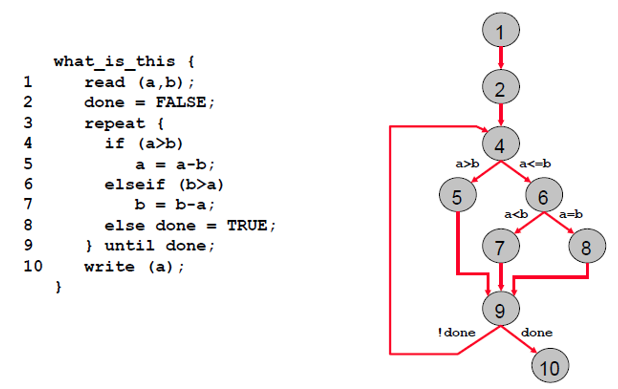
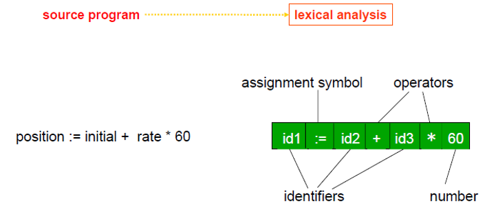
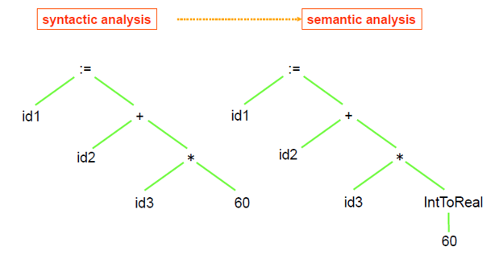
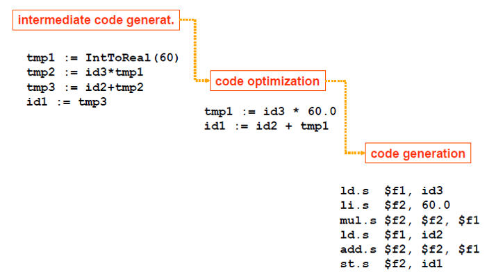

 <br><br></p><h1>TSM_EmbHardw: Loop Optimisations</h1>

----
### Index
- [1 Aims](#1-aims)
- [2 Lecture Prologue](#2-lecture-prologue)
- [3 Lecture](#3-lecture)
- [4 Lecture Epilogue](#4-lecture-epilogue)
- [5 Exercises](#5-exercises)
- [6 Laboratory](#6-laboratory)
- [Glossary](#glossary)
- [References](#references)
- [Answers to Questions](#answers-to-questions)

----
## 1 Aims

An introduction to various software optimisations including algorithmic optimisations and loop optimisations.
The first require some knowledge of the algorithm, the others are pure software craftsmanship.

----

## 2 Lecture Prologue

 Not applicable for this lecture

----

## 3 Lecture
In this lecture we look at the kind of optimisations the programmer/coder can implement with careful consideration of what he is actually doing.

We shall cover algorithmic and loop optimisations, including
1. Loop jamming
2. Loop hoisting
3. Loop un-switching
4. Loop Peeling
5. Loop unrolling 
6. Inlining

### 3.1 Notes to Algorithmic Optimisations
As an example the rgb->greyscale shown above, generally a precursor to edge detection with Sobel. 
What happens is that the 24 bit word from the camera (three 6 bit values for each red, green and blue) is presumed to be in memory. Each word is read, the colour bits masked and then multiplied by a factor 0.3 for red, 0.59 for green and 0.11 ( adds up to 1) for blue. 
The grey scale is then created by adding the factorised red, green blue and written back to the picture. 

When this code is profiled then, with an image of 240*320, 24652839 cpu cycles are required which corresponds to an execution time of ca. 0.5s.
The calculation takes 22579200 cycles or `294` cycles per pixel. 

In this version of the Data Flow Graph there is no shape-distinguishing between operations and data itself. 
The graph is constructed from the assembler source code of the rgb to greyscale C code. 
There are two points we can make – the first is that the loop counter (loop_3) on the right takes 1 CPU cycle to happen. 
The second is that there are three divisions that are known to be expensive – in this particular case up to 32 clock cycles each. 
So the question is – can the number of divisions be reduced – and if so then this represents an algorithmic optimisation. 
Generally speaking one would have to include a check for over- and underflow, in this particular case given the small size of the data involved 6 bit * 6 bit is 12 bits and the final addition adds 2 bits so with a short the calculations could be done – there is no need to check for under or overflow – it would however be helpful if it was documented somewhere !!!

*Note*: The execution time of multipliers and dividers was traditionally dependent on the values that were being used, hence the phrasing `upto 32 clock cycles each` 
From this, concepts such as constant-time multipliers, i.e. multipliers that perform multiplication of any value, were born.   

In the first optimised version of the algorithm the Data Flow Graph shows a reduction to `76` cpu cycles/pixel by eliminating two divisions. 
This represents a factor `3.87 ( 294 / 76 )` improvement. 

There is a further division by a constant which potentially costs `32` cycles, the constant being 100. 
If this could be converted into a shift by making this a power of 2 then it would make this operation into a 1 CPU cycle stage. 

For example the table shows us that by replacing the original factors by other values which are then divided by 256 -> i.e. an eight byte shift. 
The error induced by these approximations (compare to the error accepted by the Sobel approximation) are minimal. 
Therefore, the multiplications can be replaced by the new values (77, 151 and 28) and the division replaced by a shift by 8. 

We have now achieved a very cheap optimisation by manipulating the algorithm a little. 
We have `63` cpu cycles per pixel and the calculation is speeded up by a factor of `4.67 ( 294 / 63 )`. 

It is important to note the lack of effort this optimisation cost us.          

### 3.2 Notes to Loop Unrolling
Observing the cycle for each individual assembler instruction 

The calculation 
```C
result += filter[(dy+1)*3+(dx+1)]*pixels[(y+dy)*width+(x+dx)]
``` 
resolves to
```asm
     R3 = R1+1          ; from this instruction
     ...
     R0 += R5           ; to this instruction
```
requiring a total of `15` cpu cycles.

The dx-loop overhead resolves to
```asm
     R2++               ; from this instruction
     ...
     JUMPC  loop_x      ; to this instruction
```
requiring
```C
9 cycles if dx < 2 | 3 cycles otherwise.
```

The dy-loop overhead resolves to 
```asm
     R2 = -1            ; this instruction, and
     
     R1++               ; from this instruction
     ....
     JUMPC   loop_y     ; to this instruction 
```
requiring
```C
10 cycles if dy < 2 | 4 cycles otherwise.
```

Hence, the inner loop takes 
```C 
15 + 9 = 24           // cycles when dx 2 {−1, 0} 
15 + 3 = 18           // cycles when dx = 1 
```
equating to a total of 
```C
24 + 24 + 18 = 66     // cycles where 
9 + 9 + 3 = 21        // cycles` are for loop overhead ( 33%!).
```

The outer loop takes 
```C
66 + 10 = 76          // cycles when dy 2 {−1, 0}
66 + 4 = 70           // cycles when dy = 1 
```
which results in a total of 
```C
77 + 77 + 70 = 224   // cycles, of which 
10 + 10 + 4 = 24     // cycles for loop overhead ( 11%!).
```

By unrolling the inner loop (Loop Unrolling) we potentially save `3*21 = 63 cycles`
The code will run therefore `224/224−63 = 1.4×` faster!

By unrolling the outer loop we potentially get a speed-up of `(224−63) / (224−63−24) = 1.18×`

Loop Unrolling is effective as we do not require much knowledge about the algorithm and we save overhead cycles
However, there are some problems:
The effect depends on the number of cycles spent in the body of the loop. 
This optimisation only works when we have a perfect loop 
(read no data-dependent exit of the loop).

---

## 4 Lecture Epilogue

Many compilers will implement these optimisations. 
However, the implementation is not standardised across compilers.
So after a brief note on further loop optimisations we may be interested in discussing compilers. 

### 4.1 Further Loop Optimisations
**Reversal** a subtle optimization that reverses the order in which values are assigned to the index variable. 
This can help eliminate dependencies and thus enable other optimizations. 
Certain architectures utilize looping constructs at assembly level that count in a single direction only (e.g., decrement-jump-if-not-zero [DJNZ]).

**Skewing** this technique is applied to a nested loop iterating over a multidimensional array, where each iteration of the inner loop depends on previous iterations, and rearranges its array accesses so that the only dependencies are between iterations of the outer loop.

**Splitting** or peeling – this attempts to simplify a loop or eliminate dependencies by breaking it into multiple loops which have the same bodies but iterate over different portions of the index range. 
Loop Peeling is a special case of splitting which can simplify a loop with a problematic first iteration by performing that iteration separately before entering the loop.

### 4.2 Relevant Notes on Compilers 

#### 4.2.1 Compiler Operating Procedure
A compiler performs two main operations whilst operating on a piece of source code. 
It performs 
Analysis:  - which consists of lexical analysis, syntatic analysis and semantic analysis
Synthesis: - which consists of intermediate code generation, code optimisation and code generation. 

A compiler such as GNO or LLMV will feature a frontend, a middle section and a backend.
The frontend deals with the specific high-level language (C/C++, Java ...)
The backend deals with the Instruction Set Architecture (ISA) (x86, ARM, RISC-V ...)

**Analysis** The compiler breaks up the high-level code into basic blocks. 
A basic block is a sequence of instructions where the control flow enters at the beginning and exits at the end, without stopping in-between or branching (except at the end). 

<figure class="image">
  
  <figcaption><b>Figure 1:</b> Depiction of a basic block</figcaption>
</figure>

What the compiler then does is to perform a lexical analysis (from: [Plessl](#902))

<figure class="image">
  
  <figcaption><b>Figure 2:</b> The compiler performs a lexical analysis of the source code (compiler frontend)</figcaption>
</figure>

from which it generates a so called degenerated control graphs, that is each node is a basic block rather than an individual instruction. (from: [Plessl](#902))

<figure class="image">
  
  <figcaption><b>Figure 3:</b> The compiler then performs syntatic and semantic analysis of source code (compiler frontend)</figcaption>
</figure>

It converts this graph into intermediate, machine independent, code. 
It then attempts to optimise this code before generating machine dependent code. 

**Synthesis** The machine dependent code is converted by allocation, binding and scheduling. 
This code is then further optimised using machine-dependent knowledge. (from: [Plessl](#902))

<figure class="image">
  
  <figcaption><b>Figure 4:</b> The compiler generates intermediate code and performs optimisations (middle) before generating platform specific code (backend)</figcaption>
</figure>

**Compiler driven Optimisations** 
So what compiler optimisations we can expect? 
Taking the unrolled loop as an example. 
There are nine multiplications in the basic block. 
Since gx_array is defined as const, by the semantical analysis stage, array accesses will have been replaced by the actual numbers (-1, 0 or 1). 
By the intermediate code optimisation stage the terms with multiplications by 0 will have been eliminated and the multiplications by 1 will also have been dropped. 
By the code generation optimisation phase a decision will have been made as to whether the *2 multiplications are to be converted into a left shift and how the -1 multiplications are to be dealt with. 
This is an example of local optimisations. 
Since in the original code the sobel_mac hid the 0 multiplications a compiler could not have made this local optimisations. 
Finally some compilers recommend writing for loops decrementing to zero  dependent on the architectures 
[GNU-1](#901)

Function calls are an area of global optimisation – in some compilers parameter passing is cheaper if it is done via registers rather than via the stack. This statement is however often dependent on the number of parameters you wish to pass, 4 sometimes being the critical number. Knowing this means you could write code designed to place parameters used in registers where they are used from there onwards.  

Loop unrolling and in-lining are generally command-line options - sometimes they are available on their own and sometimes they are bundled together with other optimisations – The lesson from this chapter is that you should study what optimisations your compiler supports.      

#### 4.2.2 Compiler Optimisations
Compiler optimisations are generally configured in the command line using the 
`-On where n = 0..3 `
option. 
Generally `-O0` is no optimisation and `-O3` is highly aggressive, so aggressive that in fact sometimes the code does not function on the platform.
`-O1` and `-O2` generally fulfil some compiler-specific target, code size or speed of execution.

The optimisations contained in the specific optimisation levels are also compiler specific.
Some optimisations are not included in the optimisation levels but mosrt can be specified on the command line.
For example the GNU compiler:
```bash
# not included in optimisation levels
-funroll-loops
-funroll-all-loops

# included in -O2 
-finline-small-functions

# but so is
-fdelete-null-pointer-checks
# which may be an unintended side effect
```
----

## 5 Exercises

For questions Q1..Q4 
```C
#define LOOP_SIZE 1e6
``` 

### Q 1 Loop Jamming / Loop Fusion

Examine the following code
```C
    // ---------- Task 1 - loop jamming / loop fusion
    // given are two loops - your task is to fuse the two loops and report on the difference in timing between
    // the two loops and the fused loop

    volatile long int c = 0;
    volatile long int d = 0;

    // start timing measurement
    clock_gettime(CLOCK_PROCESS_CPUTIME_ID, &start);

    for (long int i = 0; i < LOOP_SIZE; i++) {
        c++;
    }

    for (long int i = 0; i < LOOP_SIZE; i++) {
        d++;
    }

    // end timing measurement
    clock_gettime(CLOCK_PROCESS_CPUTIME_ID, &stop);
    time_diff = (stop.tv_sec - start.tv_sec) * 1e6 + (stop.tv_nsec - start.tv_nsec) / 1e3;    // in microseconds
    out_array[--i] = time_diff;

    (void)printf("Line: %d Time elapsed is %2.f\n", __LINE__,  time_diff);
```
Fuse the two loops.

### Q 2 Loop Hoisting
Examine the following code

```C

    // ---------- Task 2 - loop hoisting
    // given is one loop, identify the invariant code and remove it from the loop - measure the difference in timing
    // set up the variables
    long int *array = malloc( sizeof( long int ) * LOOP_SIZE);
    c = 2;
    d = 3;

    // start timing measurement
    clock_gettime(CLOCK_PROCESS_CPUTIME_ID, &start);

    for (long int i = 0; i < LOOP_SIZE; i++) {
        array[i] = c+d;
    }

    // end timing measurement
    clock_gettime(CLOCK_PROCESS_CPUTIME_ID, &stop);
    time_diff = (stop.tv_sec - start.tv_sec) * 1e6 + (stop.tv_nsec - start.tv_nsec) / 1e3;    // in microseconds
    out_array[--i] = time_diff;

    (void)printf("Line: %d Time elapsed is %2.f\n", __LINE__,  time_diff);
```
Hoist invariant code out of the loop

### Q 3 Loop Un-Switching
Examine the following code

```C
    // ---------- Task 3 - loop un-switching
    // given is one loop, identify the conditional code and re-order the loop -  measure the difference in timing

    // start timing measurement
    clock_gettime(CLOCK_PROCESS_CPUTIME_ID, &start);

    // setup helper variable

    for (long int i = 0; i < LOOP_SIZE; i++) {
        if (e > 0)
            array[i] = e;
        else
            array[i] = c;
    }

    // end timing measurement
    clock_gettime(CLOCK_PROCESS_CPUTIME_ID, &stop);
    time_diff = (stop.tv_sec - start.tv_sec) * 1e6 + (stop.tv_nsec - start.tv_nsec) / 1e3;    // in microseconds
    out_array[--i] = time_diff;

    (void)printf("Line: %d Time elapsed is %2.f\n", __LINE__,  time_diff);
```
Un-Switch the code

### Q 4 Loop Peeling
Examine the following code:

```C
    // ---------- Task 4 - loop peeling
    // loop peeling takes an iteration out of a loop - in this case creating a prologue and a kernel.
    // perform loop peeling and measure the difference in timing

    // create a second array
    int *y_array = malloc(sizeof(long int) * LOOP_SIZE);
    y_array[1] = 5;

    // initalise the array
    for (long int i = 0; i < LOOP_SIZE; i++) {
        array[i] = e;
    }

    // iterate through the array
    long int p = 10;

    // actual task
    // start timing measurement
    clock_gettime(CLOCK_PROCESS_CPUTIME_ID, &start);

    for (long int i = 0; i < LOOP_SIZE; ++i) {
        y_array[i] = array[i] + array[p];
        p = i;
    }

    // end timing measurement
    clock_gettime(CLOCK_PROCESS_CPUTIME_ID, &stop);
    time_diff = (stop.tv_sec - start.tv_sec) * 1e6 + (stop.tv_nsec - start.tv_nsec) / 1e3;    // in microseconds
    out_array[--i] = time_diff;

    (void)printf("Line: %d Time elapsed is %2.f\n", __LINE__,  time_diff);
```

Peel this code

### Q 5 Loop Unrolling

Given the program code below. Assume that all instructions execute in a single processor cycle (including the JLT instruction !).

```C
int sum=0; 
for ( int i=0; i<10000; i++ ) {
   sum += a[i] * b[i];
   sum /= 2;
}   		
c=sum;   
```
compiles to:

```asm
    		MOVE R5,#0               ; short sum=0
    		R0,#0                    ; for ( i=0; i <= 1000; i++ )
    		MOVE R1,#&a[0]           ; load address of vector a
    		MOVE R2,#&b[0]           ; load address of vector b
  	loop: 	LOAD R3,R0[R1]           ; load value of vector a
  	        LOAD R4,R0[R2]           ; load address of vector b
  	        MUL R3,R3,R4         
  	        ADD R5,R5,R3
    		ASR R5,R5,#1             ; sum /= 2
    		ADD R0,R0,#1             ; i++ )
    		CMP R0,#10000            ; i <= 1000; 
    		JLT loop                 ; jump to loop on less than
    		MOVE R6,#&c              ; c = sum
    		NOP
    		STORE 0[R6],R5
```

1. Mark with a circle all assembly instructions that are removed when we use loop-unrolling. 
3. How many processor cycles are required to execute this program code? 
4. When using loop-unrolling, how much do we speed up this program code? 
5. When using loop-unrolling, how many assembly instructions do we add to the code? 
6. Examine the assembler code and show where allocation, binding and scheduling have been applied.

----

## 6 Laboratory

Exercises 1..4 can be checked/solved on the platform: 
```
https://godbolt.org/
```
If you use the following framework you can copy the relevant code from each exercise into the framework to compile/run it.
compilation is automatic and is useful to examine the assembler code.
If you choose a compiler for a platform you are acquainted with - you may have to remove called functions which may not be supported on that platform.
You can modify the code to produce answers online.
The timing measurements unfortunately simply don't work as expected  (seem to be deterministically random depending on the number of lines). 

```C
/* ---------- for a x86 platform with Linux as an OS ---------- */

#include <stdlib.h>
#include <stdio.h>
#include <time.h>

#define LOOP_SIZE 1e6
    
int main ( void ) {
    double time_diff;
    // timer variables
    struct timespec start, stop;

    long int *array = (long int *)malloc( sizeof( long int ) * LOOP_SIZE);
    int c = 2;
    int d = 3;

    int e = c+d
    // start timing measurement
    clock_gettime(CLOCK_PROCESS_CPUTIME_ID, &start);

/* ********** Insert Code here ********** */

    for (long int i = 0; i < LOOP_SIZE; i++) {
        array[i] = e;
    }

/* ********** End Insert      ********** */

    // end timing measurement
    clock_gettime(CLOCK_PROCESS_CPUTIME_ID, &stop);
    time_diff = (stop.tv_sec - start.tv_sec) * 1e6 + (stop.tv_nsec - start.tv_nsec) / 1e3;    // in microseconds

    (void) printf("Line: %d Time elapsed is %2.f\n", __LINE__,  time_diff);
}
```

----

### Glossary

---

### References

<a id="901">GNU-1</a>
'Options that Control Optimizations'
https://gcc.gnu.org/onlinedocs/gcc/Optimize-Options.html
Last accessed 30.09.2025

<a id="902">Plessl</a>
Plessl, C.
'Introduction to Compilers'
http://homepages.uni-paderborn.de/plessl/lectures/2011-Codesign/slides/02-Compiler.pdf
Last accessed 2014

----
### Answers to questions

| Question / Exercise     | Platform | Default Timing | Optimised timing | Comments |
|-------------------------|----------|----------------|------------------|----------|
| Q1/E1 Loop Jamming      | NUC      | 6429 us        | 1500 us          |          |
| Q2/E2 Loop Hoisting     | NUC      | 3106 us        | 1403 us          |          | 
| Q3/E3 Loop Un-Switching | NUC      | 1662 us        | 1406 us          |          |
| Q4/E4 Loop Peeling      | NUC      | 2262 us        | 2057 us          |          | 


##### Platform Characteristics - NUC
```BASH
..../lab1$ lscpu 

Architecture:          x86_64
CPU op-mode(s):        32-bit, 64-bit
Address sizes:         39 bits physical, 48 bits virtual
Byte Order:            Little Endian
CPU(s):                8
On-line CPU(s) list:   0-7
Vendor ID:             GenuineIntel
Model name:            11th Gen Intel(R) Core(TM) i7-1165G7 @ 2.80GHz
CPU family:          6
Model:               140
Thread(s) per core:  2
Core(s) per socket:  4
Socket(s):           1
Stepping:            1
CPU max MHz:         4700.0000
CPU min MHz:         400.0000
BogoMIPS:            5606.40
```

----